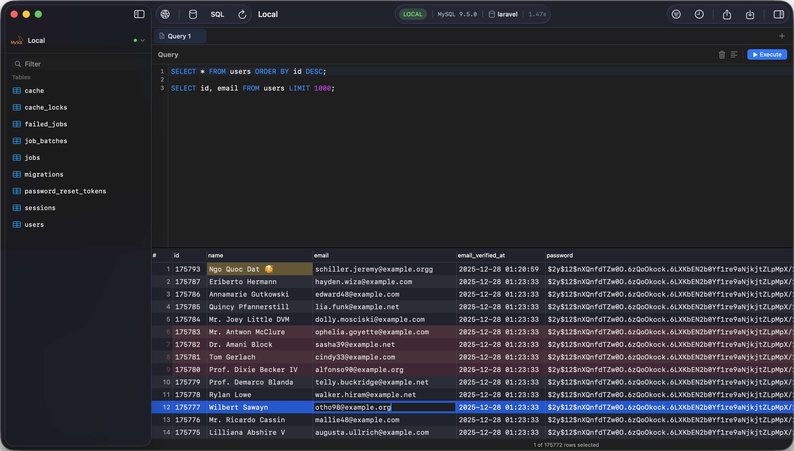

<p align="center">
  
</p>

<h1 align="center">TablePro</h1>

<p align="center">
  A fast, native macOS database client — built with SwiftUI and AppKit.
</p>

<p align="center">
  <a href="https://docs.tablepro.app">Documentation</a> ·
  <a href="https://github.com/datlechin/tablepro/releases">Download</a> ·
  <a href="https://github.com/datlechin/tablepro/issues">Report Bug</a>
</p>

---

<p align="center">
  
</p>

## About

TablePro is a lightweight alternative to TablePlus, built entirely with Apple-native frameworks. No Electron, no web views — just pure SwiftUI + AppKit for a truly native macOS experience.

## Supported Databases

- **MySQL / MariaDB** — via MariaDB Connector/C
- **PostgreSQL** — via libpq
- **SQLite** — built-in macOS library

## Features

- **SQL Editor** — syntax highlighting, autocomplete, multi-query execution, tabbed editing
- **Data Grid** — high-performance grid with inline editing, sorting, pagination, and copy as CSV/JSON
- **Change Tracking** — undo/redo, visual diff, batch commit with parameterized queries
- **Table Structure** — visual column/index/foreign key editor with schema preview
- **Filtering** — visual filter builder (AND/OR), quick search, saveable presets
- **Import & Export** — CSV, JSON, SQL with progress tracking and gzip support
- **SSH Tunneling** — password and key auth, reads `~/.ssh/config`
- **Other** — query history, connection tagging, Keychain storage, customizable themes, universal binary

## Requirements

- macOS 13.5 (Ventura) or later

## Building from Source

```bash
# Install dependencies
brew install libpq mariadb-connector-c

# Debug build
xcodebuild -project TablePro.xcodeproj -scheme TablePro -configuration Debug build

# Release build (Universal)
scripts/build-release.sh both

# Create DMG
scripts/create-dmg.sh
```

## Documentation

Full documentation is available at [docs.tablepro.app](https://docs.tablepro.app).

## License

This project is licensed under the [GNU General Public License v3.0](LICENSE).
